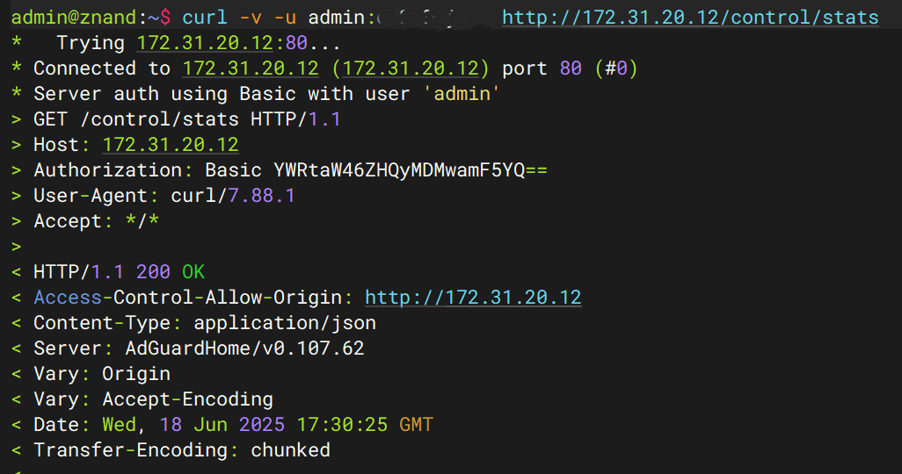
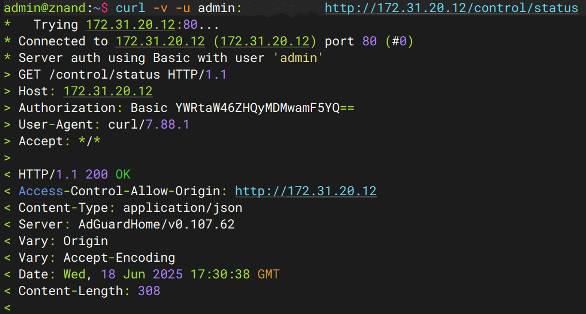
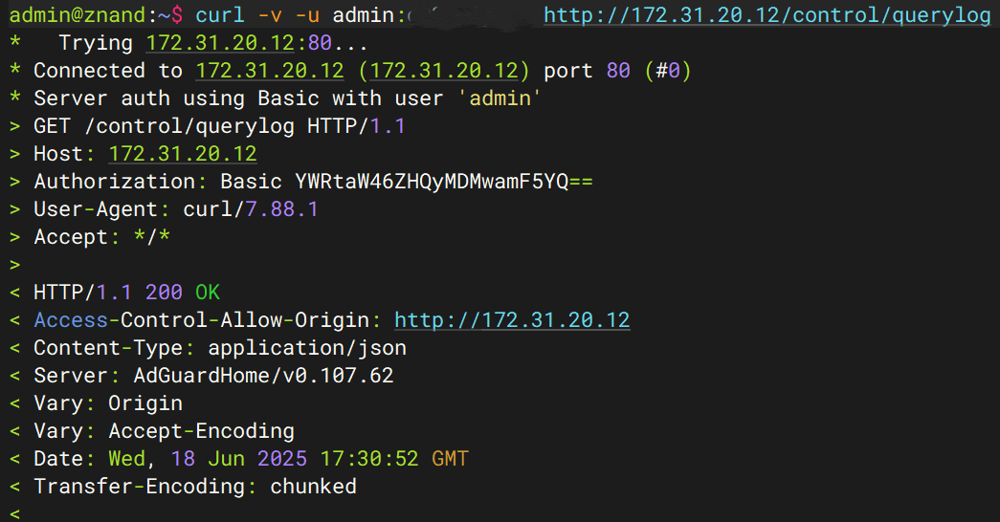

# 🛡️ AdGuard Exporter for Prometheus

A lightweight Prometheus exporter written in Go that exposes detailed metrics from your AdGuard Home instance — including DNS statistics, blocked domains, upstreams, and client data.

---

## 🚀 Features

- 🔒 Authenticated access to AdGuard Home API
- 📊 Rich metrics: total queries, blocked queries, upstream stats, per-client stats
- 🧠 Supports `/control/status` & `/control/stats` endpoints
- 🔁 Customizable scrape interval
- 📦 Lightweight single binary or Docker container

---

## 🏗️ Built With

- [Go (Golang)](https://golang.org/)
- [Prometheus Client Library](https://github.com/prometheus/client_golang)
- [AdGuard Home](https://github.com/AdguardTeam/AdGuardHome)

---
## ✅ Prerequisites

Before running this exporter, make sure:

- 🛡️ AdGuard Home is up and running
- 🔐 You have a valid AdGuard username & password
- 📡 Prometheus is configured to scrape this exporter
- 🐳 Docker installed (or alternatively Go 1.20+ for building from source)
- 🔓 Port `9200` is available on your system

To make sure the endpoint is valid, you can check the endpoints via curl

```
curl -v -u yourusername:yourpassword <ADGUARD_URL>:PORT/control/stats
curl -v -u yourusername:yourpassword <ADGUARD_URL>:PORT/control/status
curl -v -u yourusername:yourpassword <ADGUARD_URL>:PORT/control/querylog
```
---

---

---

---

---
## ⚙️ Environment Variables

| Variable         | Description                            | Required | Example                      |
|------------------|----------------------------------------|----------|------------------------------|
| `ADGUARD_HOST`     | URL to your AdGuard Home API          | ✅       | `http://192.168.1.1:3000`    |
| `ADGUARD_USER`| AdGuard Home username                 | ✅       | `admin`                      |
| `ADGUARD_PASS`| AdGuard Home password                 | ✅       | `secretpassword`             |
| `EXPORTER_PORT`   | Port to expose metrics (default: 9200)| ❌       | `9200`                       |
| `SCRAPE_INTERVAL` | How often to scrape (default: 15s)    | ❌       | `30s`                        |
| `LOG_LEVEL`       | Log Level to analyze, INFO, WARN, DEBUG | ❌      | `DEBUG`,`WARN`,`INFO`        |

---

## 🐳 Run via Docker

### ▶️ Quick Start (Inline ENV)

```bash
docker run -d \
  --name adguard_exporter \
  --restart unless-stopped \
  -p 9200:9200 \
  -e ADGUARD_HOST=http://192.168.18.1 \
  -e ADGUARD_USER=admin \
  -e ADGUARD_PASS=mysecretpassword \
  -e EXPORTER_PORT=9200 \
  -e SCRAPE_INTERVAL=15s \
  -e LOG_LEVEL=DEBUG
  znanddev/adguard-exporter:latest
```

---

## 📦 Run via Docker Compose

### 1. Create docker-compose.yml in your root dir

```yaml
version: '3.8'

services:
  adguard-exporter:
    image: znanddev/adguard-exporter:latest
    container_name: adguard_exporter
    restart: unless-stopped
    ports:
      - "9200:9200"
    environment:
      - ADGUARD_URL=http://192.168.18.1
      - ADGUARD_USERNAME=admin
      - ADGUARD_PASSWORD=admin
      - EXPORTER_PORT=9200
      - SCRAPE_INTERVAL=15s
```

### 2. Run with Docker Compose

```bash
docker-compose up -d
```

---

## 🧪 Metrics Endpoint

Once running, your exporter will be available at:

```
http://<host>:9200/metrics
```

✅ Ready to scrape by Prometheus!

---

## 📈 Example Prometheus Job

```yaml
- job_name: 'adguard-exporter'
  scrape_interval: 15s
  static_configs:
    - targets: ['adguard-exporter:9200']
```
---
## 📊 Available Prometheus Metrics
This exporter exposes the following metrics from AdGuard Home:

- `adguard_protection_enabled`: Whether DNS filtering is enabled
- `adguard_running`: Whether AdGuard Home is running
- `adguard_queries`: Total DNS queries in the last 24 hours
- `adguard_blocked_filtered`: Queries blocked by filter lists
- `adguard_blocked_safesearch`: Queries blocked due to SafeSearch
- `adguard_blocked_safebrowsing`: Queries blocked due to SafeBrowsing
- `adguard_avg_processing_time_seconds`: Average DNS query processing time in seconds
- `adguard_scrape_errors_total`: Total number of scrape errors
- `adguard_dhcp_enabled`: Whether DHCP server is enabled
- `adguard_dhcp_leases`: Number of active DHCP leases

Metrics with labels:
- `adguard_top_queried_domains{domain="example.com"}`
- `adguard_top_blocked_domains{domain="ads.example.com"}`
- `adguard_top_clients{client="192.168.1.2"}`
- `adguard_top_upstreams{upstream="8.8.8.8"}`
- `adguard_top_upstreams_avg_response_time_seconds{upstream="8.8.8.8"}`
---
---

## 📃 License

This project is licensed under the MIT License — see the [LICENSE](LICENSE) file for details.

---

## 🙌 Credits

Inspired by:
- [HenryWhitaker3/adguard-exporter](https://github.com/HenryWhitaker3/AdGuardHome-exporter)
- The AdGuard team for their awesome API

---

## ✨ Screenshots

<details>
<summary>Grafana Dashboard Preview</summary>

> _Soon..._ You can contribute a Grafana JSON 😎

</details>

---

## 💬 Feedback

Pull Requests, Issues, and Suggestions are always welcome!

**Made with ❤️ by [znanddev](https://github.com/znand-dev)**
